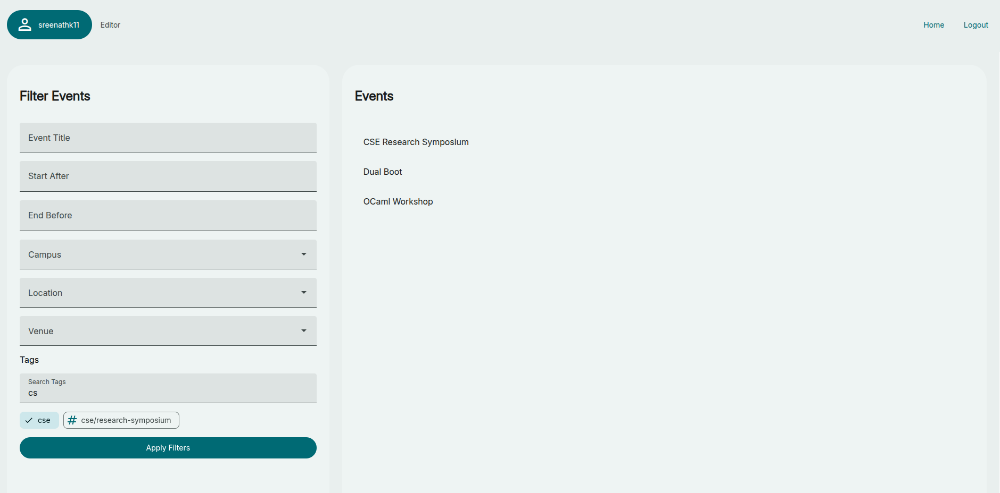
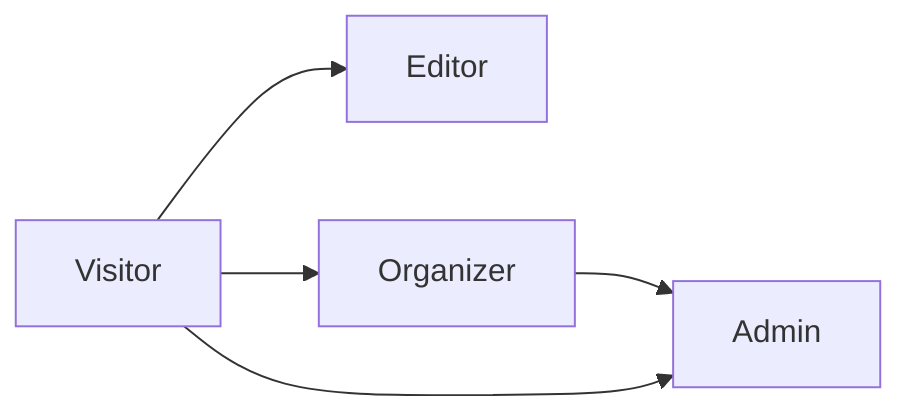
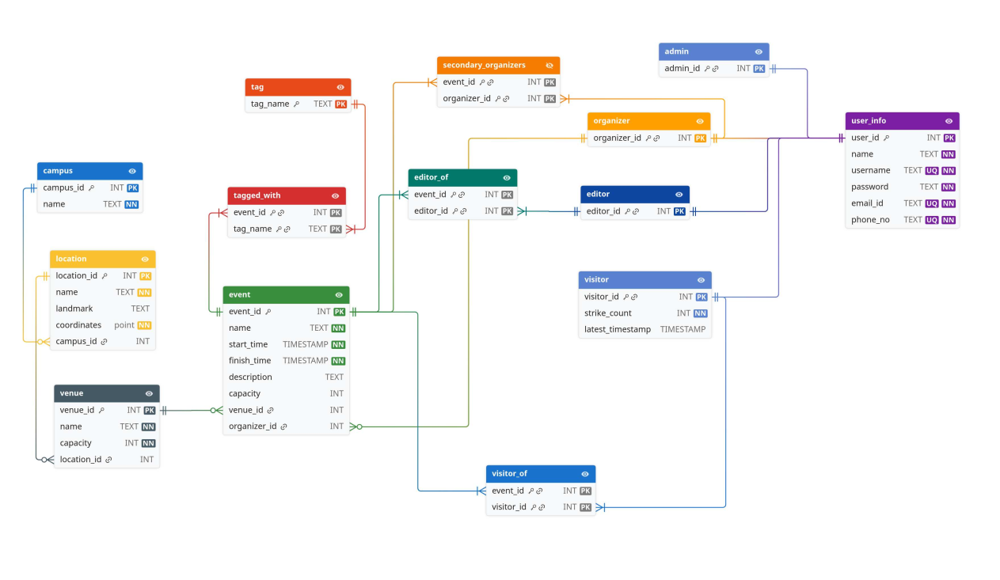
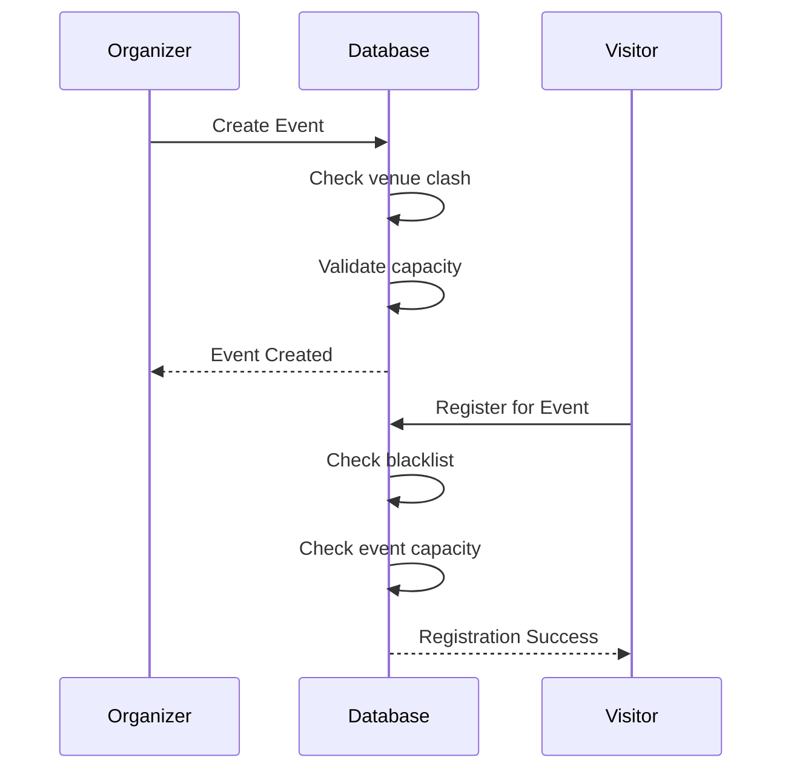
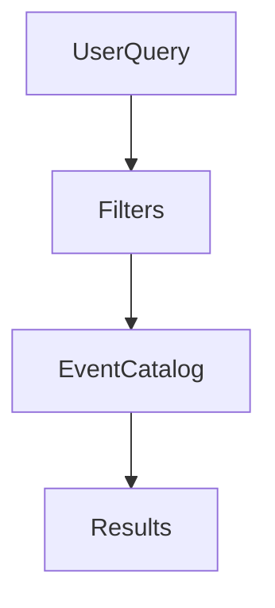

# Eagle

### Event Allocation & Geo-Location Engine

Eagle is a centralized event management platform designed for multi-campus institutions like Indian Institute of Technology Palakkad.

It provides a unified system for:

* Event creation and discovery
* Venue allocation
* Capacity management
* Role-based moderation
* Event registration and tracking


> [!NOTE]
> Eagle was designed to solve fragmented event coordination across campuses by providing a single platform for organizers, administrators, and participants.

### Home Page



---

# Features

## Event Management

* Create and manage events
* Event capacity enforcement
* Venue allocation
* Secondary organizers
* Event editors
* Event tagging system

---

## Geo Hierarchy


Each venue stores:

* GPS coordinates
* Landmark metadata
* Capacity information

---

> [!IMPORTANT]
> Venue capacities are enforced automatically using PostgreSQL triggers to prevent overbooking.

---

# Role-Based Access Control



| Role      | Capabilities                   |
| --------- | ------------------------------ |
| Visitor   | Browse and register for events |
| Editor    | Edit assigned event details    |
| Organizer | Create/manage events           |
| Admin     | Full system administration     |

---

# Database Design

The backend heavily utilizes PostgreSQL features including:

* Constraints
* Views
* Triggers
* Stored Procedures
* Indexes
* Role Privileges

---

## Database Schema



## Event Lifecycle



---

> [!WARNING]
> Events with overlapping time ranges at the same venue are automatically rejected by the database.

---

# Search & Discovery

Events can be filtered using:

* Campus
* Venue
* Location
* Organizer
* Tags
* Time ranges
* Capacity status
* Title substring
* Description substring

---

## Smart Search Support



The platform uses:

* GIN trigram indexes
* GiST indexes
* B-tree indexes
* Hash indexes

for fast and scalable querying.

---

# Backend Stack

* Python
* FastAPI
* PostgreSQL

---

# Frontend Stack

* React
* TypeScript
* Vite
* CSS

---

# Backend Setup

```bash
python3 -m venv venv
source venv/bin/activate
pip install -r requirements.txt
```

---

# Frontend Setup

```bash
cd frontend
npm install
npm run dev
```

---

# Running the Project

## Start Backend

```bash
cd backend
uvicorn app.main:app --reload
```

## Start Frontend

```bash
cd frontend
npm run dev
```

---


> [!TIP]
> Admins can reset blacklist status and promote users to higher privilege roles directly from the admin panel.

---

# Performance Optimizations

The database includes:

* GiST indexes for time-clash detection
* Trigram indexes for fast substring search
* B-tree indexes for joins and filters
* Hash indexes for blacklist lookup

---

# Contributors

* M. Sreenath Karthick
* KVS Bharath
* Raagam Hitesh Parmar
* Rajdeep

---


